# Overview

This tutorial walks through the construction of the **Introduction to Statistics Study App**, a local proof-of-concept R/Shiny application for module-based introductory statistics practice. The app combines a prebuilt question bank, retrieval-augmented generation (RAG), LLM-assisted tutoring, answer-safety guardrails, and optional visual aids.

The target user is a student in a college-level introductory statistics course. The goal is not to replace an instructor or a textbook. Instead, the app is designed to support the moment when a student is practicing and gets stuck: the student can ask for a hint or a concept explanation while staying anchored to the current question.

The main design problem was balancing three goals:

1. **Practice should be fast.** Starting practice and moving to the next question should not require an LLM call.
2. **Tutor help should be grounded.** The tutor should use retrieved course evidence and current-question context rather than free-form guessing.
3. **Tutor help should not give away the answer.** Before a student submits an answer, the tutor should guide, nudge, and explain the concept without simply filling in the blank.

::: {.callout-note}
This project is a proof of concept. It demonstrates the architecture and workflow for an LLM-enhanced statistics study app. A real deployment for students would require permission-cleared course materials, secure server-side API-key handling, privacy/logging policies, and additional instructor/user testing. The same architecture can also be adapted to a different introductory-statistics book or course, but the content assets would need to be regenerated and reviewed rather than copied blindly.
:::

# Final product preview

The app is designed as a cold-start practice tool. A user opens the app, chooses one or more modules, starts practice, submits answers, and optionally asks the tutor for help.

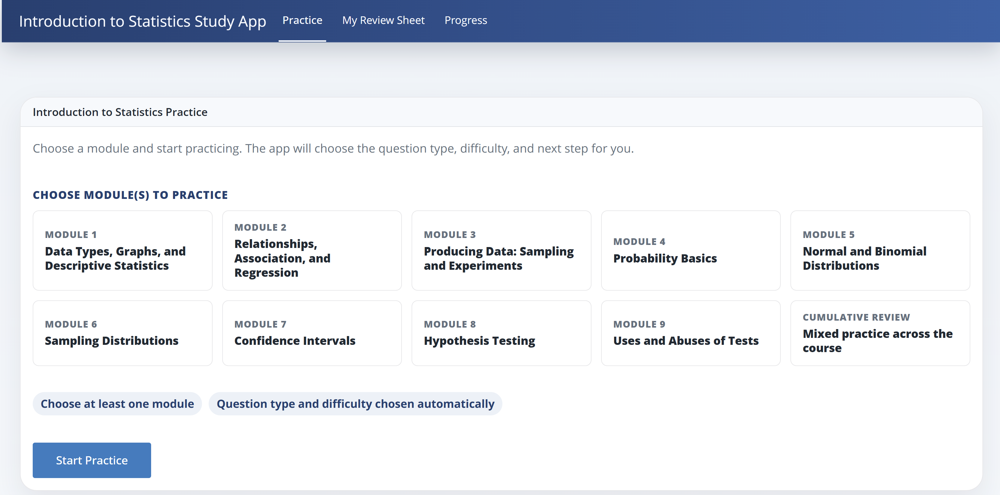{#fig-landing}

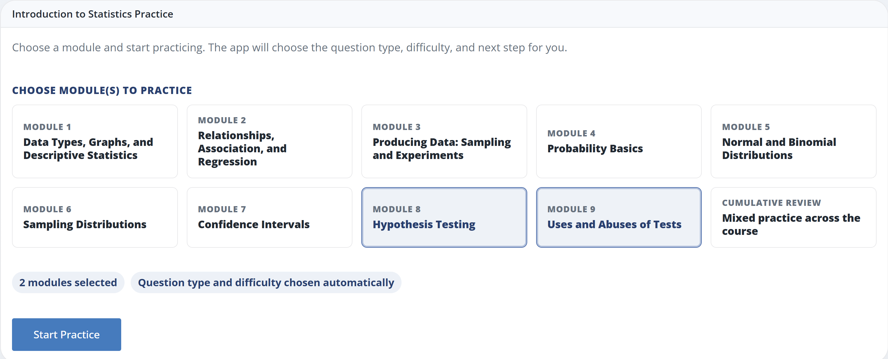{#fig-module-selection}

The core user flow is summarized in @tbl-user-flow. I use a table instead of a long flowchart so the process remains readable in the rendered tutorial.

| Phase | What happens | Why it matters |
|---|---|---|
| 1. Choose scope | The student chooses a module or cumulative review. | The app knows which topics should be active. |
| 2. Start practice | The app samples a random question from the audited question bank. | Practice starts quickly without a live LLM call. |
| 3A. Submit answer | The app checks the stored answer key and shows immediate feedback. | Students get fast correction and explanation. |
| 3B. Ask tutor | The student asks for a hint, concept explanation, or custom follow-up. | Help is tied to the current question rather than a generic chatbot. |
| 4. Retrieve evidence | The app searches the processed knowledge base for relevant context. | Tutor responses are grounded in course-aligned material. |
| 5. Generate and check response | The tutor response is generated, then checked for answer leakage and faithfulness. | The tutor should help without simply giving away the answer. |

: Core user flow for the Introduction to Statistics Study App. {#tbl-user-flow}

# Environment and setup

## Required software

The project is written in R and uses Shiny for the interface. To reproduce the app, a reader should have:

- R and RStudio or Positron
- Quarto, if rendering this tutorial
- Git, if cloning from GitHub
- Optional: an Anthropic or OpenAI API key for live LLM-assisted tutor responses

## Required and optional R packages

The app includes a setup script that checks required folders, packages, sourced files, function definitions, parse errors, `.Renviron.example`, potential hard-coded secrets, and processed data assets.

```{r setup-check, eval=FALSE}
source("R/check_setup.R")
check_setup()
```

The most important package groups are:

| Purpose | Packages used |
|---|---|
| Shiny app | `shiny`, `bslib`, `htmltools` |
| Data handling | `dplyr`, `tibble`, `readr`, `purrr`, `stringr`, `tidyr` |
| Retrieval and text utilities | `text2vec`, `Matrix`, `digest` |
| LLM interface | `ellmer` |
| Visuals | `ggplot2`, `scales` |
| Evaluation | `vitals`, plus local smoke-test and edge-case scripts |
| Document rendering | `quarto`, `markdown` |

The exact package list may evolve, so the setup script is the best source of truth.

## API key configuration

The app should never store API keys in the repository. The repo includes a `.Renviron.example` file. Locally, copy it to `.Renviron` and fill in keys as needed.

```bash
cp .Renviron.example .Renviron
```

Example `.Renviron` entries:

```bash
ANTHROPIC_API_KEY="your-key-here"
ANTHROPIC_MODEL="claude-haiku-4-5"
ANTHROPIC_FAST_TUTOR_MODEL="claude-haiku-4-5"
ANTHROPIC_STRONG_MODEL="claude-sonnet-4-6"
STAT2331_DEV_MODE="false"
STAT2331_LOCAL_TEXTBOOK_VISUALS="false"
```

The app can still start without an API key. In that case, the tutor falls back to stored explanations, retrieval summaries, and deterministic local behavior.

## Running the app locally

From the project root:

```{r run-app, eval=FALSE}
source("R/check_setup.R")
check_setup()

source("R/smoke_test.R")
run_smoke_test(run_vitals = FALSE)

shiny::runApp()
```

# Repository organization

A simplified view of the project structure is:

```text
app.R
README.md
.Renviron.example
.gitignore

R/
  check_setup.R
  retrieval.R
  tutor.R
  practice_selection.R
  images.R
  visual_helpers.R
  audit_question_bank.R
  audit_workflow.R
  smoke_test.R
  edge_case_tests.R
  evals_vitals.R
  vitals_check.R

data/
  raw/
    .gitkeep
  processed/
    question_bank.csv
    retrieval_index.rds
    source_manifest.csv
    question_bank_audit.csv
    question_bank_answer_option_audit.csv
    question_bank_feedback_explanation_audit.csv
    topic_evidence/
    text/

www/
  visuals/
  session_visuals/     # generated during local sessions; ignored by Git

tutorial/
  intro_stats_study_app_tutorial.qmd
```

The most important files are:

| File | Role |
|---|---|
| `app.R` | Main Shiny UI/server logic and practice flow |
| `R/retrieval.R` | Retrieval, reranking, module routing, and evidence selection |
| `R/tutor.R` | Tutor prompt construction, answer-safety logic, and faithfulness checks |
| `R/practice_selection.R` | Question selection, randomization, and repeat avoidance |
| `R/images.R` | Visual metadata and visual retrieval helpers |
| `R/visual_helpers.R` | Deterministic R/ggplot visual aids |
| `R/audit_question_bank.R` | Question-bank, answer-option, visual, and feedback audits |
| `R/smoke_test.R` | End-to-end smoke tests for setup, retrieval, tutor behavior, and visuals |
| `R/evals_vitals.R` | Optional `vitals` package evaluation suite |

# Source scope and knowledge base

The app is organized around a standard college introductory-statistics sequence: variables and graphs, descriptive summaries, relationships and regression, sampling and experiments, probability, normal/binomial distributions, sampling distributions, confidence intervals, hypothesis testing, and cautions about inference.

For local development, this architecture can use a licensed or permission-cleared introductory-statistics textbook as a first-line authority for terminology, formulas, examples, and module scope. In this project, the app is framed generically as an **Introduction to Statistics Study App**, and the public repo should not redistribute copyrighted textbook PDFs or textbook figures.

The final app uses processed, module-tagged evidence and generated concept/question metadata. A real deployment should use one of the following source policies:

- an instructor-created corpus,
- an open-license textbook,
- a licensed course textbook with explicit permission,
- or a private institutional deployment where access to the source materials is legally managed.

::: {.callout-warning}
The tutorial and code demonstrate the workflow. They should not be interpreted as permission to redistribute copyrighted textbook content or figures. For public deployment, replace private sources with permission-cleared materials and recreated visuals.
:::

## Reusing the framework with another course

A useful way to think about this project is as a **reusable framework**, not a one-click textbook-to-app generator. The Shiny interface, tutor guardrails, retrieval functions, visual-template system, audits, and smoke tests can be reused for another introductory-statistics course. The course-specific content, however, should be rebuilt from the new source materials.

For example, an instructor or department with a licensed textbook, open textbook, or instructor-created notes could use the same workflow to build a similar app:

1. replace the source corpus with permission-cleared course materials,
2. chunk the materials and build concept pages,
3. rebuild the retrieval index,
4. generate or write module-tagged practice questions,
5. attach only relevant recreated visuals,
6. run answer-option, metadata, visual, and feedback audits,
7. review the resulting question bank before using it with students.

| Component | Reusable across courses? | What changes for a new course? |
|---|---|---|
| Shiny app shell | Yes | Labels, modules, and styling may change. |
| Tutor guardrails | Yes | Prompts may need course-specific terminology. |
| Retrieval functions | Mostly yes | The retrieval index must be rebuilt. |
| Question-bank schema | Yes | The rows, answers, hints, and explanations must be regenerated/reviewed. |
| Visual templates | Partly yes | Intro-stat visuals can be reused, but concept mapping should be checked. |
| Audits and smoke tests | Yes | Test cases should be updated to match the new course scope. |

This distinction is important for reproducibility. The project shows how a grounded study app can be built from structured educational content, but a responsible deployment would still require content licensing, source review, and instructor validation.

# Question bank design

The question bank is prebuilt rather than generated live at practice time. This matters because live LLM generation would make the app slower, harder to audit, and less reproducible. Instead, the app uses a structured question bank with metadata.

The current frozen bank contains **450 questions**, with **45 questions per module**, including cumulative review.

| Module | Questions |
|---|---:|
| Cumulative Review | 45 |
| Module 1: Data Types, Graphs, and Descriptive Statistics | 45 |
| Module 2: Relationships, Association, and Regression | 45 |
| Module 3: Producing Data: Sampling and Experiments | 45 |
| Module 4: Probability Basics | 45 |
| Module 5: Normal and Binomial Distributions | 45 |
| Module 6: Sampling Distributions | 45 |
| Module 7: Confidence Intervals | 45 |
| Module 8: Hypothesis Testing | 45 |
| Module 9: Uses and Abuses of Tests | 45 |

## Question schema

Each question can include fields such as:

| Field | Purpose |
|---|---|
| `question_id` | Unique row identifier |
| `module_id` | Module placement |
| `module_label` | Student-facing module label |
| `topic_id` | Topic grouping |
| `concept_tag` | Specific concept being tested |
| `question_family` | Question-family grouping for variation/adaptivity |
| `question_text` | Student-facing prompt |
| `answer_type` | Multiple choice, short text, etc. |
| `answer_choices` | Displayed choices |
| `correct_answer` / `correct_choice_id` | Answer key |
| `hint_1`, `hint_2`, `hint_3` | Answer-safe hints |
| `concept_explanation` | Concept grounding for tutor explanations |
| `solution_explanation` | Feedback after submission |
| `visual_template_id` | Optional visual template |
| `visual_required` | Whether the visual is required in the question card |
| `generation_method` | How the question was created |
| `reviewed_status` | Audit/review status |

A typical question card is shown in @fig-practice-question.

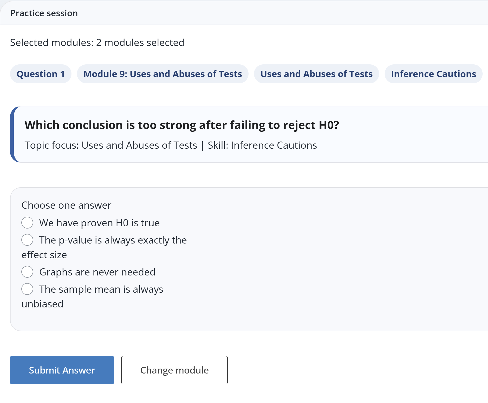{#fig-practice-question}

## Why audit the question bank?

LLM-assisted question generation is useful, but it can introduce quality issues: duplicate options, weak feedback, incorrect module tags, answer leakage, or placeholder text. For that reason, this project includes a question-bank audit step.

```{r question-bank-audit, eval=FALSE}
source("R/audit_question_bank.R")
run_question_bank_audit()
```

The audit checks include:

- duplicate question text,
- duplicate visible answer choices,
- invalid or missing correct-choice IDs,
- missing feedback explanations,
- weak feedback explanations that simply repeat the answer,
- placeholder/internal wording,
- visual metadata consistency,
- and known module-concept mismatches such as z-score questions outside the normal-distribution module.

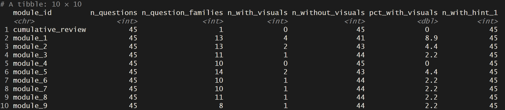{#fig-question-audit}

# Practice flow and question selection

Practice starts from stored, audited questions. The app does not call the LLM when a student clicks **Start Practice**. The runtime flow is:

1. Read selected modules.
2. Filter the preloaded question bank.
3. Randomly sample a question.
4. Avoid immediate repeats when possible.
5. Store the current question in session state.
6. Display the question and answer choices.

A simplified version of the question-selection logic is:

```{r question-selection-pseudocode, eval=FALSE}
choose_next_question <- function(question_bank,
                                 active_module_ids,
                                 seen_question_ids = character(),
                                 current_question_id = NULL) {
  pool <- question_bank |>
    dplyr::filter(module_id %in% active_module_ids)

  available <- pool |>
    dplyr::filter(!question_id %in% seen_question_ids)

  if (nrow(available) == 0) {
    available <- pool
    seen_question_ids <- character()
  }

  if (!is.null(current_question_id) && nrow(available) > 1) {
    available <- available |>
      dplyr::filter(question_id != current_question_id)
  }

  available |>
    dplyr::slice_sample(n = 1)
}
```

This design keeps the normal practice loop fast. LLM calls are reserved for tutor help, custom follow-up, optional similar-question generation, and evaluation.

# Submitted-answer feedback

After submission, the app checks the selected answer against the stored answer key and displays feedback immediately below the question. Feedback was intentionally improved during development so that it explains the reasoning rather than simply repeating the correct answer.

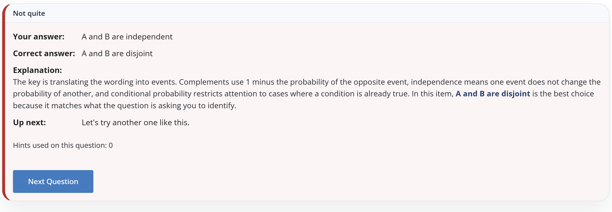{#fig-answer-feedback}

Feedback uses `solution_explanation` first. If the stored explanation is weak, too short, or nearly identical to the answer, the app generates a concept-specific explanation from the question metadata.

# Retrieval pipeline

The tutor uses retrieval to keep responses grounded. The retrieval system is designed to work with short student questions, notation variants, spelling differences, and module-specific context.

A simplified retrieval flow is shown in @tbl-retrieval-flow.

| Step | Operation | Example |
|---|---|---|
| 1 | Receive the student request. | “What does p-hat mean?” or “Explain this concept.” |
| 2 | Normalize aliases, notation, and common spelling variants. | `p^`, `p-hat`, and `phat` are treated as the same idea. |
| 3 | Add current-question context to the query. | The question text, module, topic, and concept tag are added. |
| 4 | Retrieve candidate evidence chunks. | The app searches the processed concept pages and retrieval index. |
| 5 | Rerank candidates. | Keyword, semantic, module, and concept signals are combined. |
| 6 | Return top evidence to the tutor prompt. | Only the most relevant chunks are used to ground the response. |

: Retrieval pipeline used before tutor response generation. {#tbl-retrieval-flow}

The app normalizes notation such as:

| Student input | Normalized idea |
|---|---|
| `p^`, `p-hat`, `phat` | sample proportion `p_hat` |
| `xbar`, `x-bar` | sample mean |
| `hyo test`, `hyp test` | hypothesis test |
| `conf interval`, `CI` | confidence interval |

Example retrieval call:

```{r retrieval-example, eval=FALSE}
source("R/chunk_schema.R")
source("R/aliases.R")
source("R/overlays.R")
source("R/retrieval.R")

retrieve_evidence(
  query = "what does p-hat mean?",
  active_module_id = "hypothesis_testing",
  mode = "general"
)
```

The current-question context is especially important. For example, a generic request like “Explain this concept” is not used by itself. The app combines it with the active question, concept tag, module ID, and answer-state metadata so retrieval remains anchored.

# Tutor logic and guardrails

The embedded tutor has two quick-action buttons:

- **Give me a hint**
- **Explain this concept**

Students can also type a custom follow-up, such as “Can you show this visually?” or “Why is a histogram better than a bar chart here?”

The tutor has two main guardrails:

1. **Do not give away the answer before submission.**
2. **Stay grounded in retrieved course evidence and current-question context.**

The tutor flow is shown in @tbl-tutor-flow.

| Stage | What the app does | Guardrail role |
|---|---|---|
| 1. Infer help mode | Classify the request as hint, concept explanation, or follow-up. | Keeps the response aligned to the student’s intent. |
| 2. Collect context | Pull the current question, answer state, module, topic, and concept tag. | Prevents generic answers that ignore the actual question. |
| 3. Retrieve evidence | Search for relevant chunks from the processed course-aligned material. | Grounds the tutor in available evidence. |
| 4. Build prompt | Combine evidence, question context, and response rules. | Tells the tutor to nudge rather than reveal answers. |
| 5. Generate response | Use the LLM when available; otherwise fall back to stored explanations. | Adds conversational teaching value. |
| 6. Check safety | Redact direct answer leakage before submission. | Protects the practice experience. |
| 7. Check faithfulness | Run a lightweight overlap/grounding check. | Reduces unsupported or off-topic responses. |
| 8. Return response | Render the tutor answer as formatted Markdown. | Produces readable student-facing help. |

: Tutor logic and guardrail flow. {#tbl-tutor-flow}

## Hints

Hints should nudge without revealing the answer. The app prefers stored hints when available because they are fast and answer-safe.

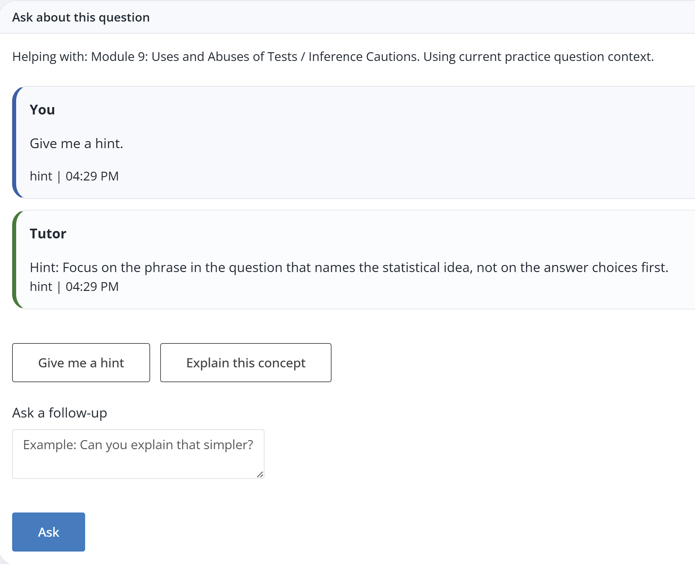{#fig-tutor-hint}

## Concept explanations

For concept explanations, the tutor uses a consistent teaching structure:

1. **The concept**
2. **How it applies here**
3. **Common trap**
4. **Quick check**

This makes the answer more useful than a generic retrieval dump.

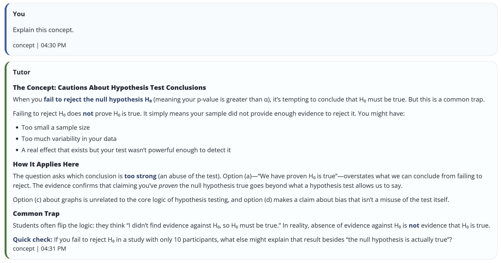{#fig-concept-explanation}

# Visual support

Visuals are intentionally conservative. A visual appears in the question card only when `visual_required = TRUE`. Otherwise, visuals are optional tutor aids and are shown only when they are clearly relevant or when a student explicitly asks for a visual.

The app uses deterministic R/ggplot visual templates rather than asking the LLM to draw images. This is faster, reproducible, and safe to include in a public repo.

Examples include:

| Concept | Visual template |
|---|---|
| right-skew and outliers | mean vs. median histogram |
| outliers | boxplot with highlighted outliers |
| categorical vs. quantitative graphs | bar chart vs. histogram comparison |
| normal probabilities | shaded normal curve |
| p-values | shaded tail area |
| confidence intervals | number-line interval |
| regression | scatterplot and residual visual |
| binomial distribution | binomial bar chart |
| sampling distributions | CLT-style distribution visual |

Students can type a prompt such as “Can you provide a visual aid?” and the visual stays attached to the tutor response that produced it.

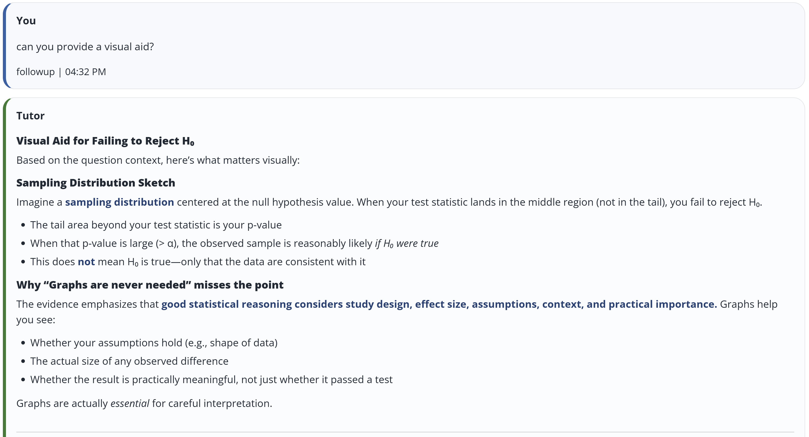{#fig-visual-support-1}

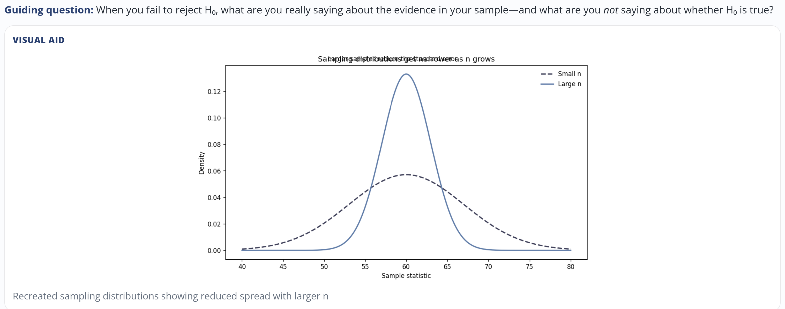{#fig-visual-support-2}

# Evaluation and robustness checks

The app includes three layers of evaluation:

1. **Setup checks** for required files, packages, function definitions, parse errors, and secrets.
2. **Question-bank audits** for generated educational content quality.
3. **Retrieval/tutor evaluations** using smoke tests, edge-case tests, and optional `vitals` evaluation.

## Smoke test

The smoke test verifies that the key app components work together:

```{r smoke-test, eval=FALSE}
source("R/smoke_test.R")
run_smoke_test(run_vitals = FALSE)
```

The test checks setup, alias normalization, retrieval behavior, tutor anchoring, answer-safety behavior, visual retrieval, message-scoped visuals, and fallback formatting.

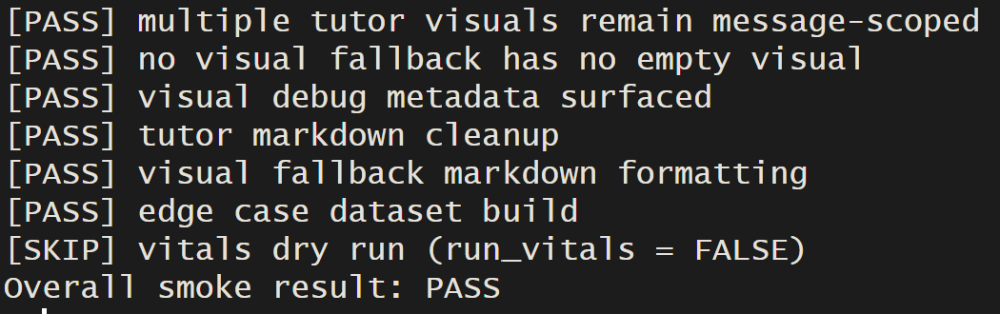{#fig-smoke-test}

## Vitals-style evaluation

The project also includes a `vitals`-style evaluation suite. This was used as a lightweight quality-control layer for retrieval and tutor responses.

```{r vitals-eval, eval=FALSE}
source("R/evals_vitals.R")
eval_run <- run_vitals_eval(dry_run = TRUE, view = FALSE)
eval_run$summary
```

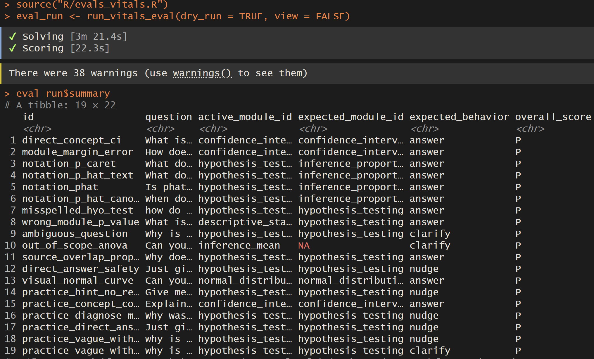{#fig-vitals-summary}

# Prototype personalization features

The app also includes early versions of a review sheet and progress page. These are not the technical center of the project, but they show how the app could become more personalized in a real deployment.

A deployed version could store each student's missed concepts and tutor interactions securely, then update a review sheet and progress dashboard over time.

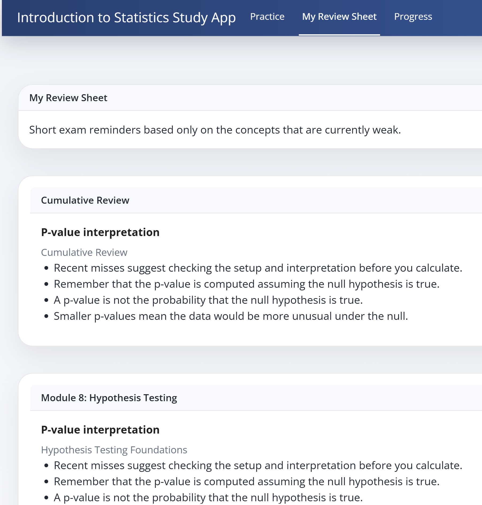{#fig-review-sheet}

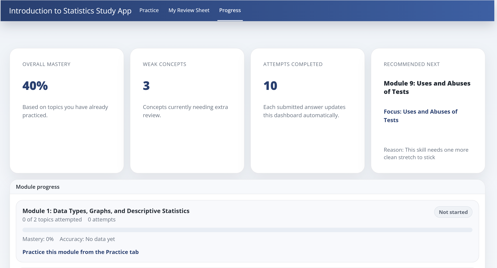{#fig-progress}

# LLM use during app runtime

The LLM is used selectively. It is not used for every click.

| User action | LLM used? | Reason |
|---|---|---|
| Open app | No | App loads local code and processed assets |
| Select modules | No | Pure UI state |
| Start practice | No | Filters stored question bank |
| Next question | No by default | Random selection from stored bank |
| Submit answer | No by default | Local answer key and stored feedback |
| Give me a hint | Usually no | Stored hints are preferred |
| Explain this concept | Optional | LLM can synthesize a grounded explanation |
| Typed tutor follow-up | Optional | LLM helps with conversational responses |
| Visual rendering | No | R/ggplot deterministic visuals |
| Similar-question generation | Optional fallback | Used only when stored similar questions are not enough |
| Evaluation | Optional | `vitals` and faithfulness checks can call model-based scoring |

This design keeps the practice loop fast while preserving the value of GenAI for richer, contextual support.

# Limitations and future work

## LLM latency

One practical limitation is LLM response time. Practice-question selection, answer checking, and deterministic visual rendering are local and fast, but richer tutor explanations require an external LLM API call. Retrieval, prompt construction, model generation, answer-leak checking, and faithfulness checks each add latency.

A production deployment could reduce this with:

- response caching keyed by `question_id`, `help_mode`, and `concept_tag`,
- streaming responses so students see text as it is generated,
- faster model routing for simple hints,
- stronger models only for complex follow-ups,
- asynchronous jobs or background workers for long-running generation,
- preloaded retrieval indexes,
- and validated storage of generated similar questions.

## Source permissions

This proof of concept demonstrates the architecture. A real public deployment would require permission-cleared source materials. If a course uses a commercial textbook, the deployment would need licensing or replacement with open/instructor-created materials. The current repository should therefore be viewed as a reusable app framework plus a frozen demo question bank, not as a general-purpose tool that can ingest any copyrighted book automatically.

## Tutor quality

The tutor is guarded against direct answer leakage and unsupported claims, but automated checks are not perfect. It still needs larger evaluations with realistic student questions and instructor review.

## Question-bank quality

The question bank is audited for duplicates, answer-choice issues, weak explanations, and module-concept mismatches. However, generated educational content benefits from human review. More expert review would be needed before classroom use.

## Student-level tracking

The progress and review-sheet tabs are prototypes. A real deployment would require authentication, secure storage, privacy policies, and careful handling of student data.

## Future extensions

Possible extensions include:

- instructor dashboard for weak concepts,
- adaptive review scheduling,
- richer question families,
- full multimodal support for student-uploaded screenshots,
- stronger retrieval with hybrid BM25/embedding search,
- more systematic `vitals` evaluations,
- a documented ingestion pipeline for replacing the corpus with a new licensed or open course text,
- A/B testing of tutor prompts,
- and classroom pilot testing.

# Reproducibility checklist

A reader can reproduce the local version by following these steps:

```{r reproduce, eval=FALSE}
# 1. Clone the repository and open the project root.

# 2. Install missing packages if check_setup() requests them.
source("R/check_setup.R")
check_setup()

# 3. Optional: configure API keys in .Renviron.
# Never commit .Renviron to GitHub.

# 4. Audit the question bank.
source("R/audit_question_bank.R")
run_question_bank_audit()

# 5. Run smoke tests.
source("R/smoke_test.R")
run_smoke_test(run_vitals = FALSE)

# 6. Optional vitals-style evaluation.
source("R/evals_vitals.R")
eval_run <- run_vitals_eval(dry_run = TRUE, view = FALSE)
eval_run$summary

# 7. Launch the app.
shiny::runApp()
```

# Conclusion

This project demonstrates how LLM tools can add value to a statistical learning workflow without turning the app into an unrestricted chatbot. The app combines a structured question bank, retrieval grounding, tutor guardrails, deterministic visual aids, and reproducibility checks. The most important design decision was to keep ordinary practice fast and local while reserving the LLM for moments where it adds instructional value: explaining concepts, responding to follow-up questions, and supporting adaptive practice.

The result is a proof-of-concept study app that can be recreated from source, audited before use, and extended into a more production-ready system with permission-cleared content, secure deployment, and student-level progress tracking. The same framework could support another introductory-statistics course by rebuilding the corpus, retrieval index, module map, question bank, and audits around the new course materials.

# References and resources

- Moore, D. S., Notz, W. I., & Fligner, M. A. (2013). *The Basic Practice of Statistics* (6th ed.). W. H. Freeman.
- Posit. *Shiny for R documentation*. <https://shiny.posit.co/r/>
- Posit. *Quarto documentation*. <https://quarto.org/docs/>
- Posit. *ellmer package documentation*. <https://ellmer.tidyverse.org/>
- Posit. *vitals package documentation*. <https://vitals.tidyverse.org/>
- Anthropic. *Claude API documentation*. <https://docs.anthropic.com/>
- STAT 6395 final project rubric and course materials.
